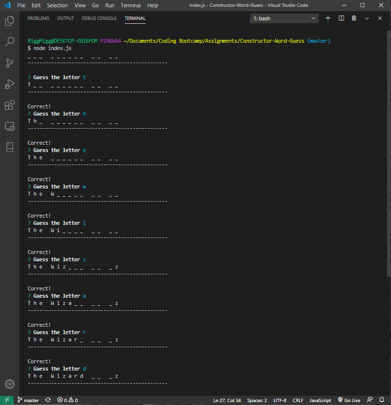
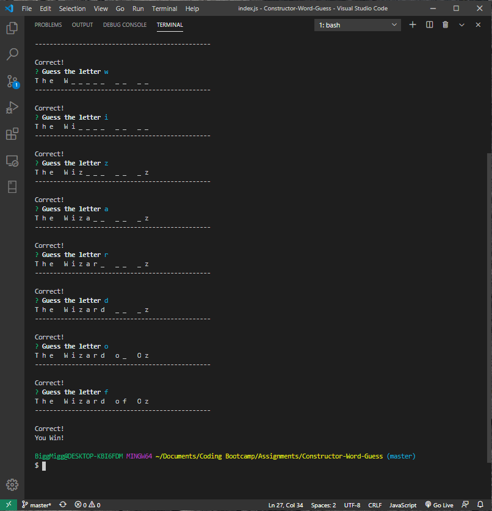
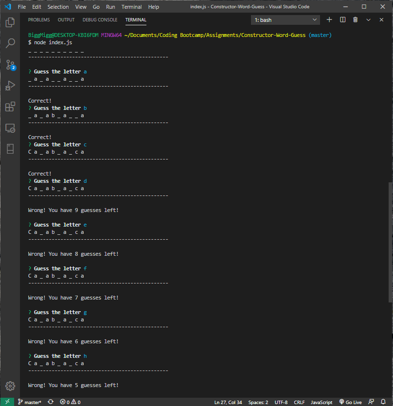
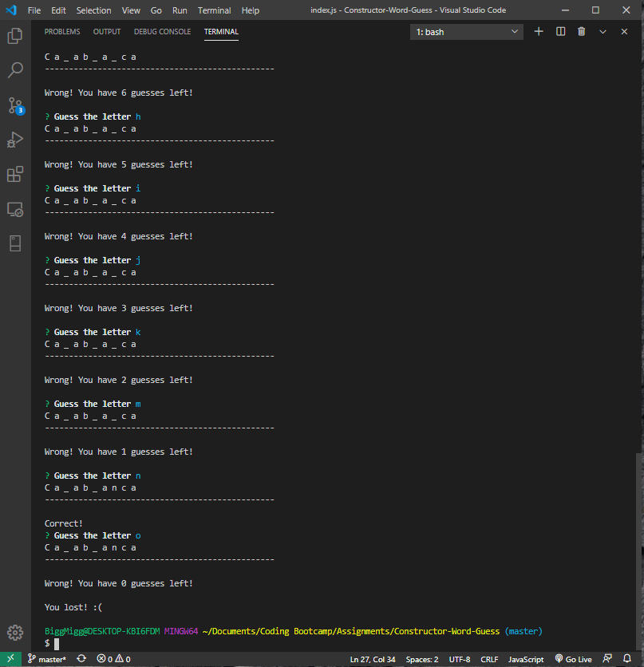

# Constructor-Word-Guess

## Overview

Constructor Word Guess is a word guess command-line game using constructor functions.

- Letter.js: Contains the constructor, Letter. This constructor displays either an underlying character or a blank placeholder (underscore), depending on whether or not the user has guessed the correct letter. The constructor includes:

    - A string value to store the underlying character for the letter
    - A boolean value that stores whether that letter has been guessed yet
    - A function that returns the underlying character if the letter has been guessed, or a placeholder (underscore) if the letter has not been guessed
    - A function that takes a character as an argument and checks it against the underlying character, updating the stored boolean value to true if it was guessed correctly

- Word.js: Contains the constructor, Word. The Word constructor depends on the Letter constructor. This is used to create an object representing the words the user is attempting to guess. The constructor includes:

    - An array of new Letter objects representing the letters of the underlying word
    - A function that returns a string representing the word. This should call the function on each letter object (the first function defined in Letter.js) that displays the character or an underscore and concatenate those together.
    - A function that takes a character as an argument and calls the guess function on each letter object (the second function defined in Letter.js)

- index.js: The file contains the logic for the course of the game, which depends on Word.js and:
    - Randomly selects a word and uses the Word constructor to store it
    - Prompts the user for each guess and keeps track of the user's remaining guesses
   
   
## Tech

**GitHub** - file repository

**Visual Studio Code** - text editor

**Javascript**

**Node.js**

**NPM Packages:**

  * **Inquirer** (https://www.npmjs.com/package/inquirer)
 
   
## Screenshots
     

     

